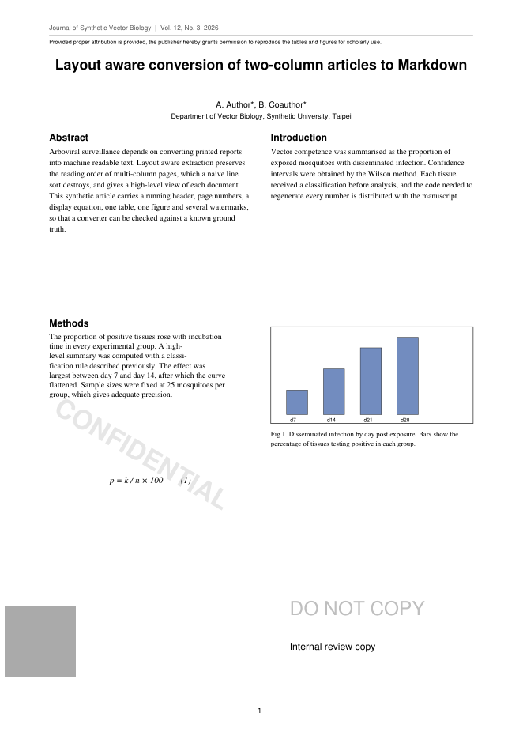
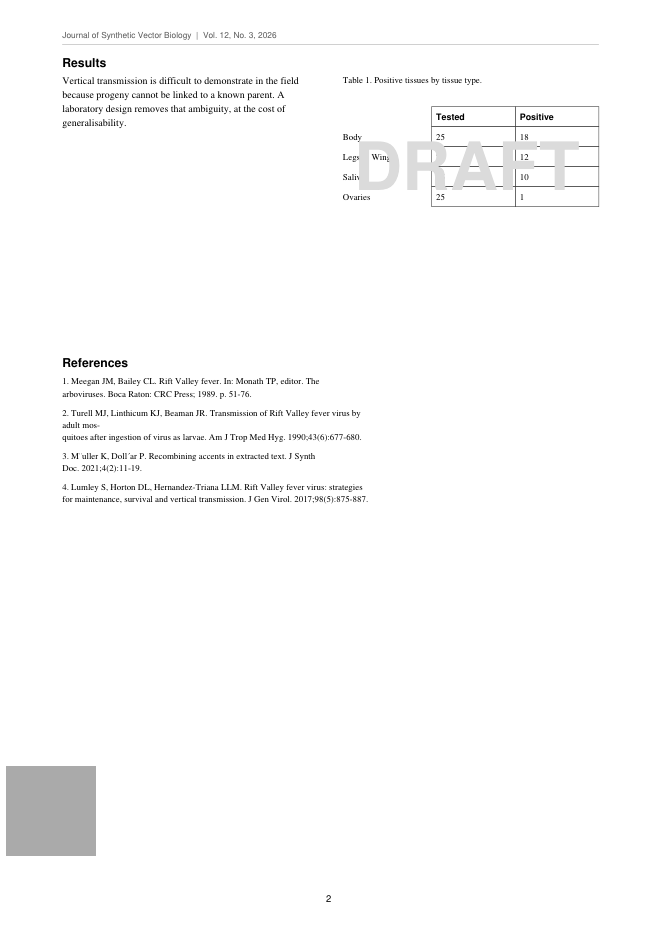

# Examples

## two-column-article.md

The finished conversion of the test fixture, after all three stages.

The source is generated, not borrowed: `tests/make_fixture.py` draws a three-page, two-column article. Nothing from a published paper is redistributed here. The first two source pages are included as images so the conversion can be compared against them:

| Source page 1 | Source page 2 |
| --- | --- |
|  |  |

Regenerate it:

```bash
python3 tests/make_fixture.py /tmp/fixture.pdf
python3 scripts/mdconvert_extract.py /tmp/fixture.pdf /tmp/out
```

`/tmp/out/fixture.md` is the deterministic stage. It matches this example except for two placeholders:

- `<!-- MDC:EQ:eq-001 -->` becomes the `$$ ... $$` block, written by the formula pass
- `<!-- MDC:FIG:fig-p01-01 -->` becomes the **Figure description** paragraph, written by the figure pass

Both passes need a vision model, so the command line alone stops at the placeholders. That is the intended behaviour, not a failure.

## What to look for

| In the source PDF | In the Markdown |
| --- | --- |
| `Journal of Synthetic Vector Biology \| Vol. 12, No. 3, 2026` on every page | absent |
| page numbers 1, 2 and 3 centred in the footer | absent |
| licence notice above the title | absent, listed under `front_matter_removed` |
| title spanning both columns | single `#` heading, emitted before either column |
| author line and affiliation | plain text, not headings |
| Abstract in column 1, Introduction in column 2 | Abstract in full, then Introduction in full, not interleaved |
| "A high-" at a line end, then "level" | "A high-level summary" |
| "classi-" at a line end, then "fication" | "a classification rule" |
| diagonal transparent CONFIDENTIAL across the Methods text | absent; the Methods paragraph is intact |
| DO NOT COPY, declared as a watermark by the PDF | absent |
| "Internal review copy" on a watermark layer | absent |
| grey stamp in the same corner of every page | not extracted as a figure |
| large light DRAFT across the table | absent from the table cells |
| bar chart drawn as vector strokes | `images/fig-p01-01.png`, cropped without its caption |
| caption below the chart | `_<u>Fig 1. ...</u>_`, italic and underlined |
| table with its row labels outside the ruled grid | pipe table with the row labels as the first column |
| `p = k / n x 100  (1)` set in italic | `$$ p = \frac{k}{n} \times 100 \tag{1} $$` |
| "mos-" at a line end inside reference 2 | "mosquitoes" |
| "M¨uller K, Doll´ar P." as TeX prints it | "Müller K, Dollár P." |
| four references numbered 1 to 4, then an Appendix | four numbered lines, same numbers, then the Appendix |
| Appendix paragraph running from column 1 into column 2 | one paragraph |
