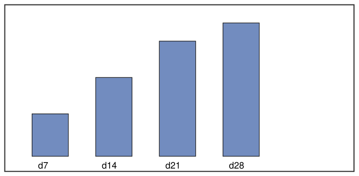

# Layout aware conversion of two-column articles to Markdown

## A. Author, B. Coauthor

## Abstract

Arboviral surveillance depends on converting printed reports into machine readable text. Layout aware extraction preserves the reading order of multi-column pages, which a naive line sort destroys. In this synthetic article we describe a two-column layout that carries a running header, a page number, a display equation, one table and one figure, so that a converter can be checked against a known ground truth.

## Introduction

Vector competence was summarised as the proportion of exposed mosquitoes with disseminated infection. Confidence intervals were obtained by the Wilson method. All analyses were carried out in a reproducible environment, and the code needed to regenerate every number in this article is distributed with the manuscript so that an independent reader can repeat the calculation without contacting the authors.

## Methods

The proportion of positive tissues rose with incubation time in every experimental group. The effect was largest between day 7 and day 14, after which the curve flattened. Sample sizes were fixed in advance at 25 mosquitoes per group, which gives adequate precision for a difference of twenty percentage points.

$$
p = \frac{k}{n} \times 100 \tag{1}
$$

_<u>Fig 1. Disseminated infection by day post exposure. Bars show the percentage of tissues testing positive in each group.</u>_

**Figure description.** A vertical bar chart with four bars and no plotted y axis scale, enclosed in a thin rectangular frame. The x axis is labelled by day post exposure: d7, d14, d21 and d28. Bar height increases monotonically from left to right, with the largest single step between d7 and d14 and progressively smaller increases afterwards, so the series flattens towards d28. All bars are drawn in one colour, and no error bars or significance annotations are shown.

## Results

Vertical transmission is difficult to demonstrate in the field because progeny cannot be linked to a known parent. A laboratory design removes that ambiguity, at the cost of generalisability. Both limitations should be stated plainly when such results are used to parameterise a transmission model.

_<u>Table 1. Positive tissues by day post exposure.</u>_

| Day | Tested | Positive |
| --- | --- | --- |
| 7 | 25 | 7 |
| 14 | 25 | 13 |
| 21 | 25 | 19 |
| 28 | 25 | 22 |

## References

1. Meegan JM, Bailey CL. Rift Valley fever. In: Monath TP, editor. The arboviruses. Boca Raton: CRC Press; 1989. p. 51-76.

2. Turell MJ, Linthicum KJ, Beaman JR. Transmission of Rift Valley fever virus by adult mosquitoes after ingestion of virus as larvae. Am J Trop Med Hyg. 1990;43(6):677-680.

3. Wilson EB. Probable inference, the law of succession, and statistical inference. J Am Stat Assoc. 1927;22(158):209-212.

4. Lumley S, Horton DL, Hernandez-Triana LLM. Rift Valley fever virus: strategies for maintenance, survival and vertical transmission. J Gen Virol. 2017;98(5):875-887.
